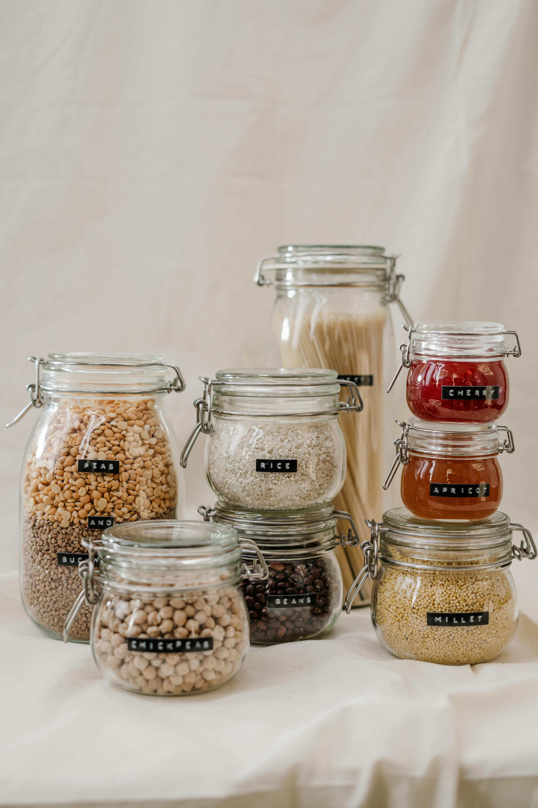

# 🌿 EcoLife – A Simple Eco-Friendly Web Project

Welcome to **EcoLife**, a responsive and beginner-friendly web project designed to promote sustainable living. This project uses HTML, CSS, and JavaScript to showcase environmental tips and create awareness in a simple grid-based layout.

## 💡 Features

- 🌍 Earthy aesthetic with calming colors and visuals
- 📱 Fully responsive layout using CSS Grid
- 📸 Eco-themed image cards with tips
- 🔁 Dynamic sustainability tips using JavaScript
- 🔗 Ready to deploy on GitHub Pages


## 🚀 Live Demo

Check out the live version here:  
[🔗 EcoLife on GitHub Pages](https://otienoeugine.github.io/Eco-Life/)

## 🛠️ Built With

- HTML5
- CSS3
- JavaScript (Vanilla)
- Git & GitHub

## 📸 Screenshots



## ✅ How to Run Locally

1. Clone the repository:
   ```bash
   git clone https://github.com/otienoeugine/Eco-Life.git

